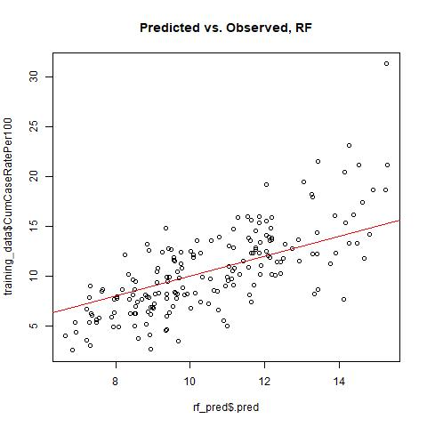
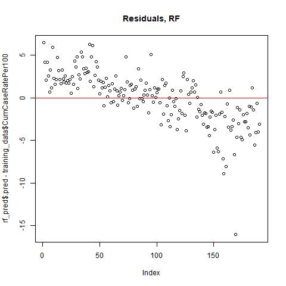

# Summary/Abstract
There is substantial heterogeneity in population demographics and health status within states; therefore, a model is needed with a more granular resolution. In this study, we focus on the state of Texas, aiming to characterize the inter-county variability and identify important predictors of COVID-19 case burden. We located counties with the highest case burdens, visualized their trends over time, and identified the proportion of Hispanic individuals as the most important feature in our final machine learning model. Given limited resources, decisions for COVID-19 testing, monitoring, and interventions must be data-driven: understanding the patterns in COVID-19 burden at the county-level can inform targeted public health interventions and resource allocation. 

# Introduction 
As of November 19, 2021, the unprecedented coronavirus disease 2019 (COVID-19) pandemic, caused by severe acute respiratory syndrome coronavirus 2 (SARS-CoV-2), has accounted for at least 47,030,792 cases and 759,388 deaths in the United States alone [@WHO-2021]. We hypothesized that the proportion of some high-risk groups may be importants predictors for COVID-19 case burden. According to the CDC, age is the strongest risk factor for severe COVID-19 morbidity; additionally, the risk of severe COVID-19 increase as the number of underlying medical conditions increase in an individual [@CDC-risk]. Communities of color in the United States experience structural, social, and environmental inequities that increase risk for infection and severe illness [@Bhala-2020] and have experienced substantial barriers to and disparities in COVID-19 testing [@NPR-2020]. Given the health disparities for high-risk and vulnerable groups at the individual level, we sought to examine the associations between county-level demographic data and cumulative COVID-19 case rate. These findings may help guide public health response and resource allocation, such as vaccine distribution, deployment of mobile testing units, health messaging/education, wastewater monitoring, and medical resources (i.e., personal protective equiment and ICU beds).

## Description of data and data source
Cumulative confirmed COVID-19 case counts at the county-level, confirmed COVID-19 case counts at the county- and state-level over time, and 2019 county-level population estimates were obtained from the Texas Department of State Health Services [@Texas-dashboard] on October 3rd, 2020. The shapefile of Texas with county borders and data on county size was obtained from the Texas Tech University Center for Geospatial Technology [@Texas-GIS].

## Questions/Hypotheses to be addressed
1. Investigate the spatial heterogeneity of COVID-19 cumulative incidence within Texas.
2. Investigate county-level incidence of COVID-19 within Texas over time.
3. Evalauate the associations between county-level characteristics and COVID-19 burden within Texas.

# Methods and Results
The cumulative case rate across Texas was 11.7 cases per 100 persons, calculated by dividing the number of confirmed cases as of October 3, 2020 (n = 3,394,815) by the 2019 population estimate of 29,001,602 people. The cumulative case rate per county ranged from 2.6 (King County, TX) to 31.3 cases (Dimmit County, TX) per 100 persons. On average, the counties were 1% Asian, 6.2% Black, 50.9% male, 18.5% over 65 years of age, and 29.7% had at least one medical condition. Additionally, on average, the counties had a 2019 population of 114,180 persons and an area of 2,739 square kilometers. As expected, counties with major cities had the highest total cases; in order to compare across counties with different population sizes, cumulative case rates per 100 persons were mapped to visualize spatial heterogeneity across Texas. Additionally, epidemic curves were constructed to visualize new cases over time at the state- and county- levels (subset to 10 counties with the highest cumulative case rates). In Texas, the three waves of the epidemic appear to peak around the end of July, beginning of January, and end of September. These trends are mostly reflected in the county-level maps, perhaps with a few deviations due to differences in testing rates and scale of interventions. County-level risk factors included in our analysis were: age (% 65 and older), gender (% male), race/ethnicity (% Black, Asian, and Hispanic), and any medical condition that increases risk of severe illness from COVID-19*. Population density and population size were found to be significantly correlated (Pearson's correlation coefficient: 0.94, 95% CI: 0.93, 0.95); since our models include a population component in its rate calculation, we chose to drop population density in favor of county area.

To estimate the association between county-level risk factors and cumulative case rate, the following models were developed: Poisson regression, negative binomial regression, generalized mixed effects model, and multivariable linear regression. For the Poisson model, the assumption that the mean and variance of the outcome, cumulative COVID-19 case counts, were approximately equal was violated; additionally, there was evidence of severe overdispersion. Ultimately, this model was rejected as an appropriate model choice. The negative binomial regression model was included to relax the assumption of mean-variance equivalence and, accordingly, had superior performance. Additionally, the generalized mixed effects model incorporated county as a random effect in order to capture the inter-county variation in testing rates. These three aformontioned models fit case count as the outcome of interest offset by the natural logarithm of the 2019 county-level population estimates in order to estimate cumulative incidence rate ratios. On the other hand, we assigned cumulative case rates as our continuous outcome of interest in a linear regression model, utilizing the Tidymodels framework in R. We utilized two machine learning methods for variable selection and hyperparameter tuning, regularization, and optimization: 1) a penalized linear regression model (LASSO), which enacts a regularization penalty on coefficients that shrinks the impact of or drops irrelevant predictors from the model, and 2) a random forest model, which uses a bagging method to build an ensemble of decision trees (MADA 2021). Before fitting these models, we fit a simple linear regression model to each potential predictor, assessing the degree to which the response variable is explained by the predictor via r-squared. All analyses were conducted in R version 4.1.0 (2021-05-18) [@R-base]. 

To ensure that our predictors were informative in all our models, we built a null model as a baseline for model performance (RMSE on training data = 4.30). For model evaluation, we inspected model performance metrics (root mean square error (RMSE) and r-squared) and diagnostic plots. Fitted vs. residual plots, normal QQ plot, scale-location, and residuals vs. leverage were compared between models for the assumption of linearity of the predictor and outcome, constant variance of residuals, normality of residuals, and independence of residuals error terms. For our linear regression model that was built in TidyModels, we were also able to split the dataset into training and testing data sets to perform cross-validation. LASSO removed the % male feature and applied a penality of 0.1 to remaining predictors. While the random forest model does not remove predictors, the VIP package in R [@VIP-R] also selected % male as the second least important variable. The best model for each approach was chosen based on RMSE; finally, the model performance and diagnostic plots for the best LASSO model and random forest model were compared. Since the model performance for the best LASSO model (RMSE = 3.82) and the best random forest model (RMSE = 3.77) were very similar for the training data, we selected the random forest model as our final model and proceeded to conducting 5-fold cross-validation on the test dataset one single time. Compared to the model performance of our null model on testing data (RMSE = 3.81), we can see that our final model had a slightly superior performance metric (RMSE = 3.32). 

Our final model identified the following predictors as the most important, in order: % Hispanic, % 65+, % Medical Condition, % Asian, % Black, % Male, and area. Still, the low r-squared (rsq = 0.244) and the diagnostic plots indicate that model results should not be over-interpreted.

*According to the Texas Department of Health: "People 16 years of age and older with at least one chronic medical condition that puts them at increased risk for severe illness from the virus that causes COVID-19. The data are model-based estimates from CDC using self-reported data from the Behavioral Risk Factor Surveillance System and U.S. census population data. The methodology for generating these estimates are detailed in this MMWR: https://www.cdc.gov/mmwr/volumes/69/wr/mm6929a1.htm".

## Exploratory analysis

Cases over time for Texas.

```{r epicurve, fig.cap='', echo=FALSE}

```

Map of Texas, highlighting counties with the highest COVID-19 case burden

```{r map_rates, fig.cap='', echo=FALSE}
knitr::include_graphics("../../results/map_rates.png")

```

Average characteristics across Texas

```{r summarytable, echo=FALSE, message = FALSE, warning = FALSE}
library(tidyverse)

resulttable=readRDS("../../results/summarytable.rds")
knitr::kable(resulttable, caption = '') %>%
  kableExtra::kable_classic(full_width = F, html_font = "Times New Roman")
```

County-level characteristics across Texas, subset to counties with the highest COVID-19 case burden

```{r table_county, echo=FALSE, message = FALSE, warning = FALSE}
library(tidyverse)

resulttable_county=readRDS("../../results/table_county.rds")
knitr::kable(resulttable_county, caption = '') %>%
  kableExtra::kable_classic(full_width = F, html_font = "Times New Roman")
```

Cases over time for Texas counties with the highest COVID-19 case burden

```{r epicurve_county,  fig.cap='', echo=FALSE}
knitr::include_graphics("../../results/epicurve_county.png")
```

## Full Analysis

Variable Importance, Random Forest Model

```{r rf_vip,  fig.cap='', echo=FALSE}

```

# Discussion

## Summary and Interpretation
Our final model selected the percent of Hispanic individuals as the most important predictor; in fact, it had at least 2.5 times more of an impact compared to the second most important model feature, % 65+. Of note, 4 out of the 10 counties with the highest case burden in the state border Mexico and have a population that is 47-95% Hispanic (compared to the state average of 37%). Resource allocation must be targeted; for example, these counties have a high proportion of first-dose vaccination (54-89%). Ramping up health communication (with Spanish translation) around prevention, wastewater monitoring, and allocation of medical resources may be more appropriate for these specific communities.

Underreporting in cases, due to county-level variation in testing availability and individual-level differences in healthcare access and health-seeking behavior, is a standard consideration in disease reporting. With the significant proportion of asymptomatic cases and issues in testing capacity during the early phase, it is a particularly important challenge in the current COVID-19 epidemic. We believe that utilizing county-level risk factors, in addition to counts of cases, hospitalizations, and deaths, may allow for a more robust public health response. 

## Strengths and Limitations
There are many potentially important predictors that were not considered in this study, such as county-level proportions for urban/rural, household size, and socio-economic status. Outcomes should be adjusted for testing rates to more fairly compare across counties. While the mixed effects model had the best performance metric of all models (RMSE = 2.82), we're unable to assess overfitting without performing cross-validation; thus, we did not move forward on this model. Additionally, we did not add a spatial component to any model due to the complexity of incorporating case counts for out of state (and country) counties that border Texas and may be important drivers of transmission; this potentially may have improved model fit. Comorbidities here are aggregated; however, some have more evidence than others.

## Conclusions
This study identified counties with the highest COVID-19 burden and important predictors for county-level COVID-19 cumulative case rates.

## Supplementary Figures
Negative Binomial Model Evaluation

```{r NegBinomial_diagnosticplots,  fig.cap='', echo=FALSE}
knitr::include_graphics("../../results/NegBinomial_diagnosticplots.jpeg")
```

```{r NegBinomial_pred_vs_obs,  fig.cap='', echo=FALSE}
knitr::include_graphics("../../results/NegBinomial_pred_vs_obs.jpeg")
```

```{r NegBinomialresiduals,  fig.cap='', echo=FALSE}
knitr::include_graphics("../../results/NegBinomial_residuals.jpeg")
```

Generalized Linear Mixed Model Evaluation

```{r mixed_pred_vs_obs,  fig.cap='', echo=FALSE}
knitr::include_graphics("../../results/MixedModel_pred_vs_obs.jpeg")
```

```{r mixedresiduals,  fig.cap='', echo=FALSE}

```

LASSO Model Evaluation

```{r LASSO_pred_vs_obs,  fig.cap='', echo=FALSE}
knitr::include_graphics("../../results/LASSO_predicted_vs_observed.jpeg")
```

```{r LASSOresiduals,  fig.cap='', echo=FALSE}

```

```{r LASSO_tuning,  fig.cap='', echo=FALSE}

```


```{r LASSO_regularization,  fig.cap='', echo=FALSE}

```

Random Forest Model Evaluation

```{r rf_pred_vs_obs,  fig.cap='', echo=FALSE}

```

```{r rfresiduals,  fig.cap='', echo=FALSE}

```

Final Model (Random Forest) on Test Data

```{r rf_final_pred_vs_obs,  fig.cap='', echo=FALSE}

```

```{r rf_final_residuals,  fig.cap='', echo=FALSE}

```

# References


