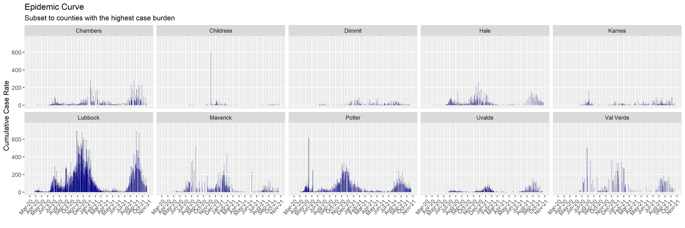
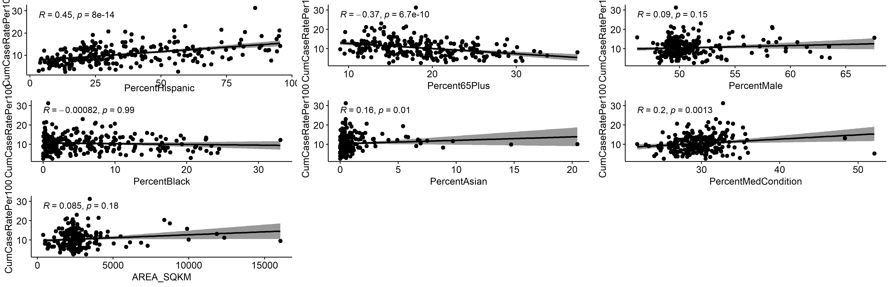

# Summary/Abstract
Understanding the patterns in COVID-19 burden at the county-level can inform targeted public health interventions and resource allocation.

# Introduction 
Given limited resources, decisions for COVID-19 testing, monitoring, and interventions must be data-driven. We aim to characterize the inter-county variability in COVID-19 burden and identify important predictors to help guide public health response and resource allocation, such as vaccine distribution, deployment of mobile testing units, health messaging/education, wastewater monitoring, and hospital equipment. Utilizing county-level risk factors in decision-making, in addition to case counts, hospitalizations, and deaths, may allow for a more robust public health response. 

## General Background Information
Underreporting in cases, due to county-level variation in testing availability and individual-level differences in healthcare access and health-seeking behavior, is a standard consideration in disease reporting. With the significant proportion of asymptomatic cases and issues in testing capacity during the early phase, it is a particularly important challenge in the current COVID-19 epidemic.

## Description of data and data source
* Data from the Texas Health Department: https://dshs.texas.gov/coronavirus/AdditionalData.aspx
    + Cases.and.Fatalities: case count data at the county-level, total 
    + Trends: new cases at the state-level, by date 
    + NewCasesTime: new cases at the county-level, by date
    + Demographics: sex, race/ethnicity
    + Vaccination: 1-dose and fully vaccinated population, population 65+ from 2019 Census population estimates, population 16-64 any medical condition*
    
* Shapefile of Texas with county boundaries: https://www.depts.ttu.edu/geospatial/center/TexasGISData.html
    + Includes data on county population and area to calculate county population density

## Questions/Hypotheses to be addressed
* Investigate the spatial heterogeneity of COVID-19 incidence within Texas over time at the county-level.
* Evalauate the associations between county-level characteristics (e.g., population density, population demographics, and vaccination coverage) and COVID-19 burden.

# Methods and Results
Cumulative numbers of COVID-19 cases and 2019 population estimates for each county were obtained from the Texas Department of Health. As counties containing major cities (e.g., Houston, Dallas, Fort Worth) had the highest total cases, cumulative case rates per 100 persons were calculated and mapped to visualize spatial heterogeneity across Texas counties. Epidemic curves were constructed to visualize new cases over time at the state- and county- levels (subset to 10 counties with the highest total case burden). County-level risk factors included in our analysis were: age (65 and older), gender (male), race/ethnicity (Black, Asian, and Hispanic), and any medical condition that increases risk of COVID*. 

To estimate the association between county-level risk factors and cumulative case incidence, the following models were developed: Poisson regression, negative binomial regression, multivariable linear regression, and a generalized mixed effects model. For the Poisson model, the assumption that the mean and variance of number of cumulative COVID-19 cases were approximately equal was violated; additionally, there was evidence of severe overdispersion. Ultimately, this model was rejected as an appropriate model choice. The negative binomial regression model was included to relax the assumption of mean-variance equivalence and, accordingly, had superior performance. Several diagnostic plots (fitted vs. residual plots, normal QQ plot, scale-location, and residuals vs. leverage) were inspected to test if linear regression model assumptions were met. Indeed, the assumptions of linearity of the predictor and outcome, constant variance of residuals, normality of residuals, and independence of residuals error terms of the multivariable linear regression were accepted. 

We used the TidyModels framework in R to build a penalized linear regression model (LASSO) and Random Forest regression model. LASSO removed the proportion male variable and applied a penality of 0.1 to remaining predictors. While the Random Forest model does not remove predictors, the VIP package in R also selected PercentMale as the least important variable. The best model for each approach was chosen based on RMSE and diagnostic plots, which was very similar (LASSO RMSE = 3.82, RF RMSE = 3.76). We selected the LASSO model as the final model and conducted 5-fold cross-validation on the test dataset one single time.

*People 16 years of age and older with at least one chronic medical condition that puts them at increased risk for severe illness from the virus that causes COVID-19. The data are model-based estimates from CDC using self-reported data from the Behavioral Risk Factor Surveillance System and U.S. census population data. The methodology for generating these estimates are detailed in this MMWR: https://www.cdc.gov/mmwr/volumes/69/wr/mm6929a1.htm.

## Data import and cleaning

## Exploratory analysis

Cases over time for Texas.

```{r epicurve,  fig.cap='', echo=FALSE}
knitr::include_graphics("../../results/epicurve.png")
```

County-level characteristics across Texas

```{r summarytable,  results = 'asis', echo=FALSE, message = FALSE, warning = FALSE}
library(tidyverse)

resulttable=readRDS("../../results/summarytable.rds")
knitr::kable(resulttable, caption = '') %>%
  kableExtra::kable_classic(full_width = F, html_font = "Times New Roman")
```

Map of Texas, highlighting counties with the highest COVID-19 case burden

```{r map_rates,  fig.cap='', echo=FALSE}
knitr::include_graphics("../../results/map_rates.png")
```

County-level characteristics for Texas counties with the highest COVID-19 case burden

```{r table_county,  results = 'asis', echo=FALSE, echo=FALSE, message = FALSE, warning = FALSE}
library(tidyverse)

resulttable=readRDS("../../results/table_county.rds")
knitr::kable(resulttable, caption = '') %>%
  kableExtra::kable_classic(full_width = F, html_font = "Times New Roman")
```

Cases over time for Texas counties with the highest COVID-19 case burden

```{r epicurve_county,  fig.cap='', echo=FALSE}

```

Association between county-level characteristics and total confirmed COVID-19 cases.
Spearman's correlation coefficient and regression line

```{r associations,  fig.cap='', echo=FALSE}

```

## Full analysis
Negative Binomial Model Evaluation

```{r NegBinomial_diagnosticplots,  fig.cap='', echo=FALSE}

```

```{r NegBinomial_pred_vs_obs,  fig.cap='', echo=FALSE}

```

```{r NegBinomialresiduals,  fig.cap='', echo=FALSE}

```

Generalized Linear Mixed Model Evaluation

```{r mixed_pred_vs_obs,  fig.cap='', echo=FALSE}

```

```{r mixedresiduals,  fig.cap='', echo=FALSE}
knitr::include_graphics("../../results/MixedModel_residuals.jpeg")
```

LASSO Model Evaluation

```{r LASSO_pred_vs_obs,  fig.cap='', echo=FALSE}
knitr::include_graphics("../../results/LASSO_predicted_vs_observed.jpeg")
```

```{r LASSOresiduals,  fig.cap='', echo=FALSE}
knitr::include_graphics("../../results/LASSO_residuals.jpeg")
```

Random Forest Model Evaluation

```{r rf_pred_vs_obs,  fig.cap='', echo=FALSE}
knitr::include_graphics("../../results/RF_pred_vs_obs.jpeg")
```

```{r rfresiduals,  fig.cap='', echo=FALSE}
knitr::include_graphics("../../results/RF_residuals.jpeg")
```

# Discussion

## Summary and Interpretation
_Summarize what you did, what you found and what it means._

## Strengths and Limitations
There are many potentially important predictors that were not considered in this study, such as county-level proportions for urban/rural, household size, and socio-economic status. 

## Conclusions
_What are the main take-home messages?_

_Include citations in your Rmd file using bibtex, the list of references will automatically be placed at the end_

This paper [@Leek2015a] discusses types of analyses. 

Note that this cited reference will show up at the end of the document, the reference formatting is determined by the CSL file specified in the YAML header. Many more style files for almost any journal [are available](https://www.zotero.org/styles). You also specify the location of your bibtex reference file in the YAML. You can call your reference file anything you like, I just used the generic word `references.bib` but giving it a more descriptive name is probably better.


# References


