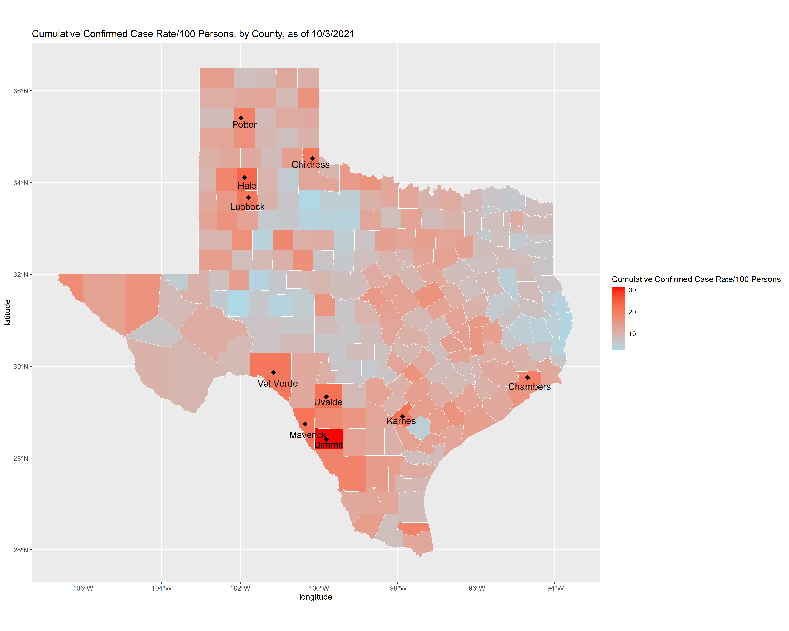

# Summary/Abstract
Understanding the patterns in COVID-19 burden at the county-level can inform targeted public health interventions and resource allocation.

# Introduction 
Given limited resources, decisions for COVID-19 testing, monitoring, and interventions must be data-driven. We aim to characterize the inter-county variability in COVID-19 burden and identify important predictors to help guide public health response and resource allocation, such as vaccine distribution, deployment of mobile testing units, health messaging/education, wastewater monitoring, and hospital equipment. Utilizing county-level risk factors in decision-making, in addition to case counts, hospitalizations, and deaths, may allow for a more robust public health response. 

## General Background Information
Underreporting in cases, due to county-level variation in testing availability and individual-level differences in healthcare access and health-seeking behavior, is a standard consideration in disease reporting. With the significant proportion of asymptomatic cases and issues in testing capacity during the early phase, it is a particularly important challenge in the current COVID-19 epidemic.

## Description of data and data source
* Data from the Texas Health Department: https://dshs.texas.gov/coronavirus/AdditionalData.aspx
    + Cases.and.Fatalities: case count data at the county-level, total 
    + Trends: new cases at the state-level, by date 
    + NewCasesTime: new cases at the county-level, by date
    + Demographics: sex, race/ethnicity population
    + Vaccination: 1-dose and fully vaccinated population
  
* Shapefile of Texas with county boundaries: https://www.depts.ttu.edu/geospatial/center/TexasGISData.html
    + Includes data on county population and area to calculate county population density

## Questions/Hypotheses to be addressed
* Investigate the spatial heterogeneity of COVID-19 incidence within Texas over time at the county-level.
* Evalauate the associations between county-level characteristics (e.g., population density, population demographics, and vaccination coverage) and COVID-19 burden.

# Methods and Results
* Estimate county-level cumulative rates of COVID-19: new cases per 100,000 county residents
* Test for spatial autocorrelation using Moran's I
* Multivariable regression, with spatial effects, using negative binomial regression to account for overdispersion (excess zeroes)

## Data import and cleaning

## Exploratory analysis

Cases over time for Texas.

```{r epicurve,  fig.cap='', echo=FALSE}
knitr::include_graphics("../../results/epicurve.png")
```

County-level characteristics across Texas

```{r summarytable,  results = 'asis', echo=FALSE, message = FALSE, warning = FALSE}
library(tidyverse)

resulttable=readRDS("../../results/summarytable.rds")
knitr::kable(resulttable, caption = '') %>%
  kableExtra::kable_classic(full_width = F, html_font = "Times New Roman")
```

County-level characteristics for Texas counties with the highest COVID-19 case burden

```{r table_county,  results = 'asis', echo=FALSE, echo=FALSE, message = FALSE, warning = FALSE}
library(tidyverse)

resulttable=readRDS("../../results/table_county.rds")
knitr::kable(resulttable, caption = '') %>%
  kableExtra::kable_classic(full_width = F, html_font = "Times New Roman")
```

Map of Texas, highlighting counties with the highest COVID-19 case burden

```{r map_rates,  fig.cap='', echo=FALSE}

```

Cases over time for Texas counties with the highest COVID-19 case burden

```{r epicurve_county,  fig.cap='', echo=FALSE}
knitr::include_graphics("../../results/epicurve_county.png")
```

Association between county-level characteristics and total confirmed COVID-19 cases.

```{r associations,  fig.cap='', echo=FALSE}
knitr::include_graphics("../../results/p_combined.png")
```

## Full analysis
Output of a mixed effects model

```{r glm_mixed,  fig.cap='GLM Random Effects Model.', echo=FALSE, message = FALSE, warning = FALSE}
library(sjPlot)
model=readRDS("../../results/model.rds")
tab_model(model) 
```

# Discussion

## Summary and Interpretation
_Summarize what you did, what you found and what it means._

## Strengths and Limitations
There are many potentially important predictors that were not considered in this study, such as county-level proportions for urban/rural, medical conditions, household size,  socio-economic status, and frontline workers. While this study model used cumulative case counts, future studies investigating county-level case counts over time should also examine variant proportions and testing rates as predictors.

## Conclusions
_What are the main take-home messages?_

_Include citations in your Rmd file using bibtex, the list of references will automatically be placed at the end_

This paper [@Leek2015a] discusses types of analyses. 

Note that this cited reference will show up at the end of the document, the reference formatting is determined by the CSL file specified in the YAML header. Many more style files for almost any journal [are available](https://www.zotero.org/styles). You also specify the location of your bibtex reference file in the YAML. You can call your reference file anything you like, I just used the generic word `references.bib` but giving it a more descriptive name is probably better.


# References


